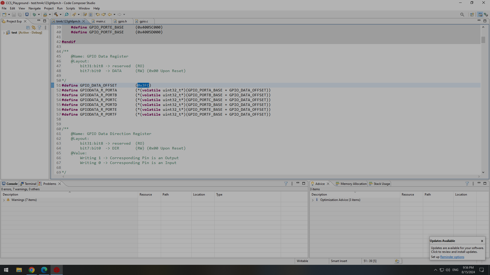
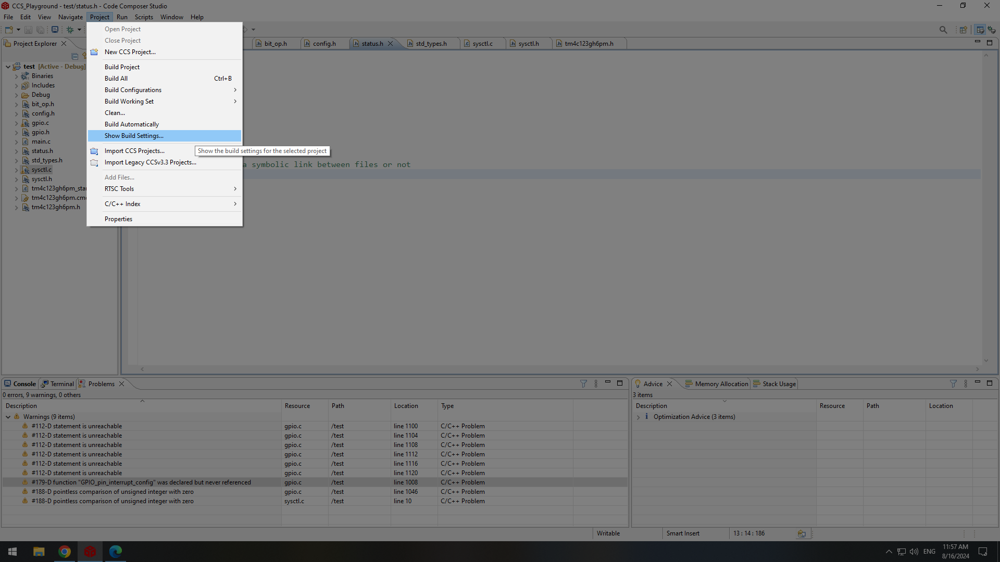
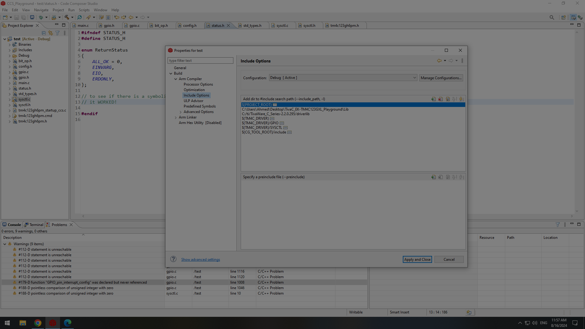
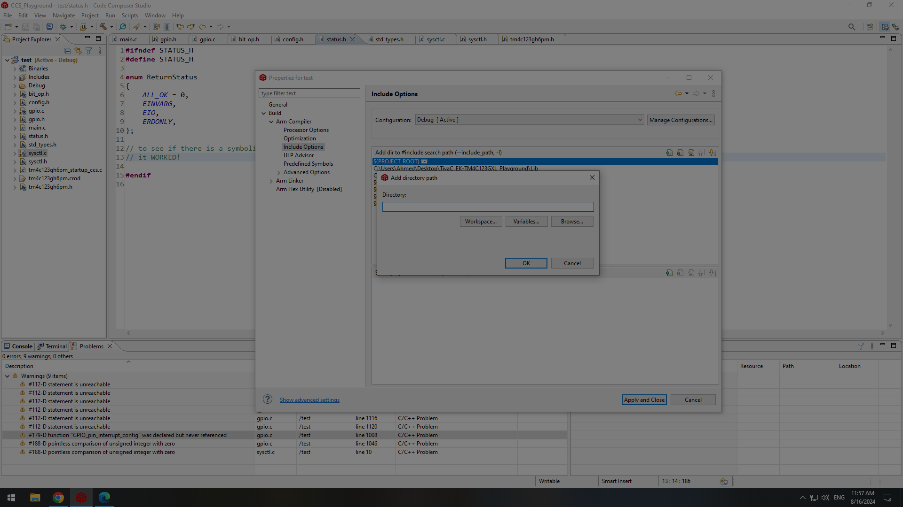
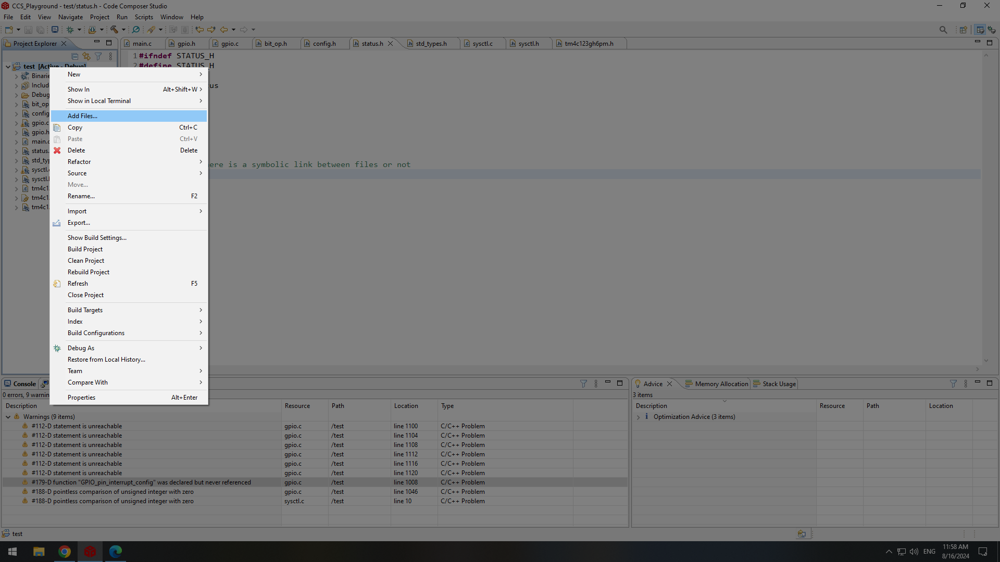
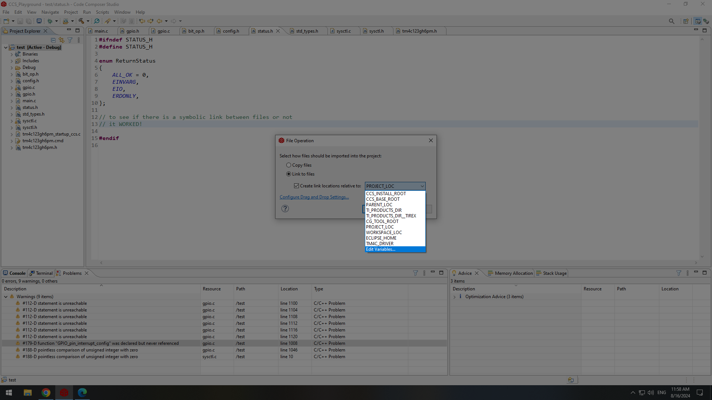
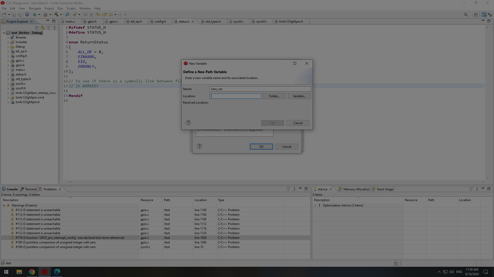
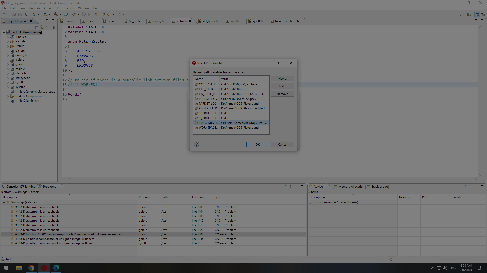

# TivaC_Playground

This repository contains my special drivers written for EK-TM4C123GXL LaunchPad (based on TM4C123GH6PM MCU) + Some projects cuz why not! XDD
**NOTE:** I know it is best to design mcu drivers with macros to save space as much as possible but I want to both practise using M4 mcus and flex my C language skills.

## Bro Tip: Symbolic Link Between Files in a CCS Project
I want to document this for future reference since I will probably forget how to do it but I am too lazy to write it down. So, here are a bunch of screenshots to *visualize* the steps needed to create a symbolic link with a file outside your CCS project directory.
// \\

## Using GPIO
1. Enable gpio port clock via the function `SYSCTL_gpio_port_clk_config(_port_index, _config);
` located in `sysctl.h`. the first argument is one of the options specified in `enum GPIO_PortIndex` in `gpio.h` and the second argument is either `ENABLE` or `DISABLE` as specified in the defined enum located in `std_types.h`.
2. (Optional) Enable AHB bus for a gpio port via the function `SYSCTL_gpio_port_bus_config(PORTF, ENABLE);` **AFTER SETTING THE `GPIO_PORT_BUS` MACRO in config.h**. Note that **there must be a delay after this action before configuring gpio registers ##VIMP**
3. Define a pin struct like this: `struct GPIO_pin pin_red_led;`.
4. Initialize the pin defined in step 2 by giving is the **address** of the struct, the port index, and pin index. `GPIO_pin_init(&pin_red_led, PORTF, PIN1);`
5. For each of the gpio pin configurations, there is a function to configure it:
  1. Alternate Function Select: `GPIO_pin_AFSEL_config(&pin_red_led, ENABLE);`
  2. Digital Enable: `GPIO_pin_digital_config(&pin_red_led, ENABLE);` 
  3. Data Direction: `GPIO_pin_direction_config(&pin_red_led, OUTPUT);`
  4. Resistor Configuration: `GPIO_pin_resistor_config(&pin_red_led, PULL_UP_RESISTOR);` (can be any of the choices listed in enum GPIO_ResistorType located in gpio.h)
  5. Current Drive: `GPIO_pin_drive_current_config(&pin_red_led, DRIVE_CURRENT_8MA);` (can be any of the choices listed in enum GPIO_CurrentDrive located in gpio.h)
  6. Slew Rate: `GPIO_pin_slew_rate_config(&pin_red_led, DISABLE);`
6. For writing digital data: `GPIO_pin_digital_write(&pin_red_led, HIGH);`
7. For reading digital data: `GPIO_pin_digital_read(&push_button1)`
8. For pin interrupt configuration:
   1. Set Port ISR: `GPIO_set_pin_ISR(&pin, &isr)`
   2. Set Pin Interrupt Sense (Rising/Falling/High-Level/Low-Level): `GPIO_pin_interrupt_sense_trig_config`
   3. Pin Interrupt Mask Configuration: `GPIO_pin_interrupt_mask_config(&pin, ENABLE)`
